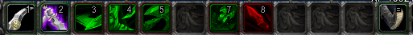
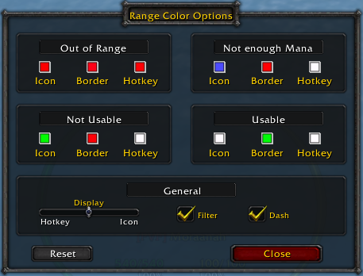

# RangeColor_OctoWoW
Rework of existing RangeColor addon so it can work nicely on OctoWoW client.

Changes the icon color and/or HotKey text color when the skill is out of range, has no mana or isn't usable.

Type /rc or /rangecolor to open Configuration menu where you can select colors and set the desired mode of the addon with the slider.

In the Configuration menu, you have a Slider with three positions:
- Leftmost is 'Hotkey', that will only shade the hotkey text on the icon. (this is identical to the default behavior but you can choose color) 
- Rightmost is 'Icon', that will only shade the icon.
- And the middle (without name), will shade the icon if there is no hotkey, but if the button has a hotkey
then it will shade the hotkey text only instead of the entire icon.

Also you have "Filter" and "Slash" options:
- "Filter" will change the text of the hotkey, for example, from "Alt-1" to "A-1".
- And "Slash" will change it, form "A-1" to "A1".
- Same goes for Shift and Ctrl.

